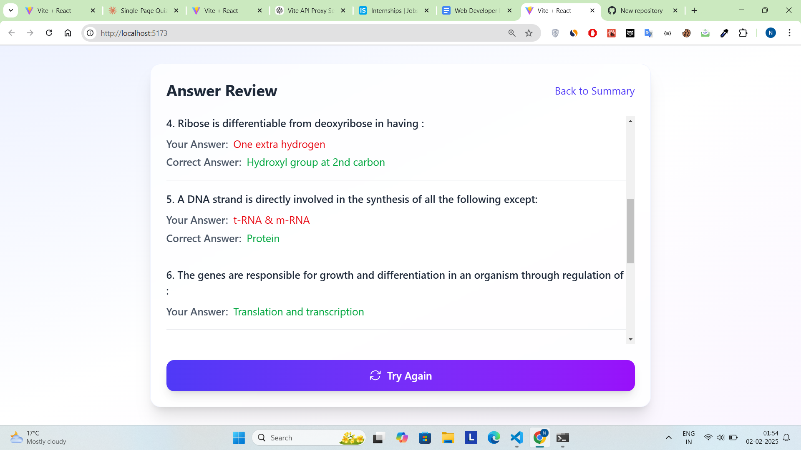
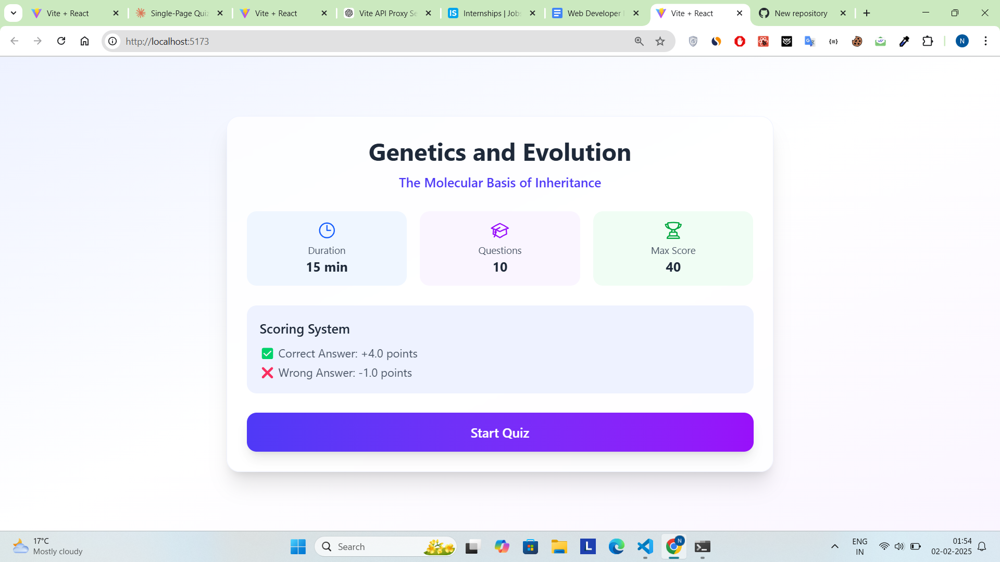
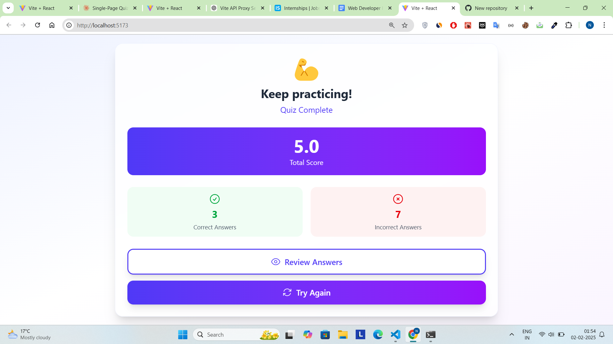
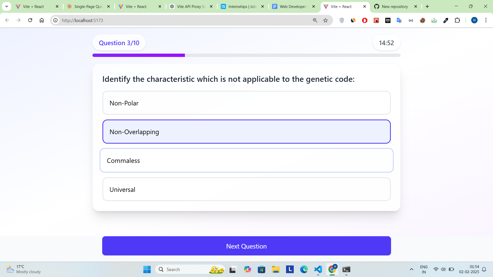

# 🧠 Quiz App

A dynamic and interactive quiz application built with **React**, **React Query**, **Framer Motion**, and **Radix UI**. Users can answer multiple-choice questions, track their progress, and test their knowledge in an engaging way.

## 🚀 Features

- 🎯 **Dynamic Questions** - Fetches quiz data in real-time.
- ⏳ **Countdown Timer** - Answer before time runs out!
- ✅ **Instant Feedback** - Highlights correct and incorrect answers.
- 🔄 **Smooth Transitions** - Animated UI powered by Framer Motion.
- 📊 **Progress Tracking** - See your quiz progress with Radix UI components.

## 🛠️ Tech Stack

- **Frontend:** React, React Query, Framer Motion, Radix UI
- **State Management:** React Context API
- **Styling:** Tailwind CSS

## 📦 Installation

1. Clone the repository:
   ```sh
   git clone https://github.com/NinadxBaruah/quiz-app.git
   cd quiz-app
   ```
2. Install dependencies:
   ```sh
   npm install
   ```
3. Start the development server:
   ```sh
   npm run dev
   ```

## 📌 Usage

1. Select the correct answer before the timer runs out.
2. Click **Next** to proceed to the next question.
3. Track your score and progress in real-time.

## 📽️ Video

<video src="https://github.com/user-attachments/assets/c2e4ddad-5bb1-495b-9e8c-f1e304eac3fd" controls="controls" style="max-width: 100%;">
</video>

## 📷 Screenshots






## 💡 Future Enhancements

- [ ] Add support for different quiz categories.
- [ ] Implement a leaderboard system.
- [ ] Allow users to create custom quizzes.

## 📜 License

This project is open-source and available under the [MIT License](LICENSE).

---

Made with ❤️ by [Ninad Baruah](https://github.com/NinadxBaruah)
